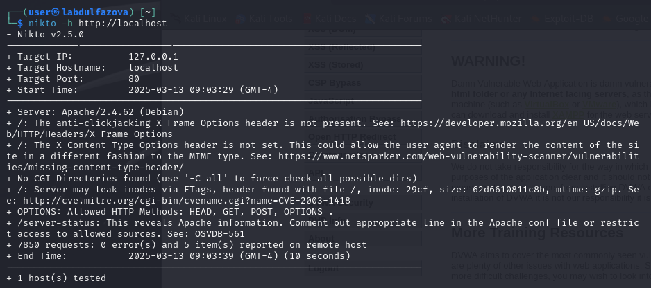
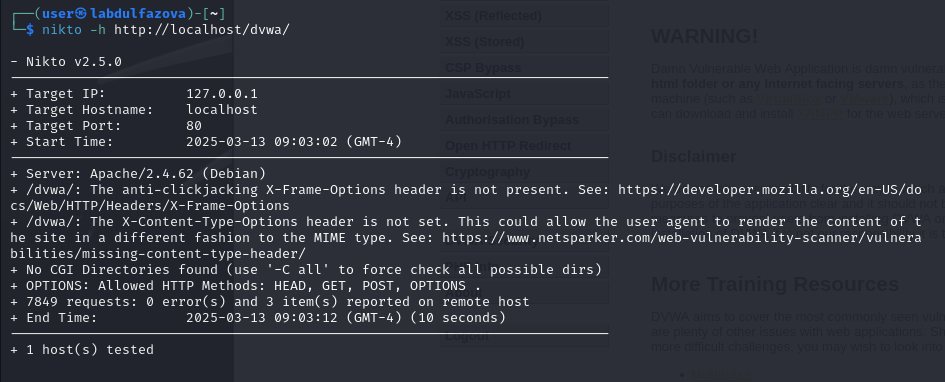

---
# Front matter
lang: ru-RU
title: "Индивидуальный проект - этап 4"
subtitle: "Использование nikto"
author: "Лейла Абдулфазова"

# Formatting
toc-title: "Содержание"
toc: true # Table of contents
toc_depth: 2
lof: true # List of figures
fontsize: 12pt
linestretch: 1.5
papersize: a4paper
documentclass: scrreprt
polyglossia-lang: russian
polyglossia-otherlangs: english
mainfont: PT Serif
romanfont: PT Serif
sansfont: PT Sans
monofont: PT Mono
mainfontoptions: Ligatures=TeX
romanfontoptions: Ligatures=TeX
sansfontoptions: Ligatures=TeX,Scale=MatchLowercase
monofontoptions: Scale=MatchLowercase
indent: true
pdf-engine: lualatex
header-includes:
  - \linepenalty=10 # the penalty added to the badness of each line within a paragraph (no associated penalty node) Increasing the value makes tex try to have fewer lines in the paragraph.
  - \interlinepenalty=0 # value of the penalty (node) added after each line of a paragraph.
  - \hyphenpenalty=50 # the penalty for line breaking at an automatically inserted hyphen
  - \exhyphenpenalty=50 # the penalty for line breaking at an explicit hyphen
  - \binoppenalty=700 # the penalty for breaking a line at a binary operator
  - \relpenalty=500 # the penalty for breaking a line at a relation
  - \clubpenalty=150 # extra penalty for breaking after first line of a paragraph
  - \widowpenalty=150 # extra penalty for breaking before last line of a paragraph
  - \displaywidowpenalty=50 # extra penalty for breaking before last line before a display math
  - \brokenpenalty=100 # extra penalty for page breaking after a hyphenated line
  - \predisplaypenalty=10000 # penalty for breaking before a display
  - \postdisplaypenalty=0 # penalty for breaking after a display
  - \floatingpenalty = 20000 # penalty for splitting an insertion (can only be split footnote in standard LaTeX)
  - \raggedbottom # or \flushbottom
  - \usepackage{float} # keep figures where there are in the text
  - \floatplacement{figure}{H} # keep figures where there are in the text
---

# Цель работы

Целью данной работы является изучение сканера уязвимостей nikto.

# Введение

## Nikto: Описание

**Nikto** — это популярный сканер веб-серверов с открытым исходным кодом, который проверяет веб-серверы на наличие уязвимостей, неправильных настроек, устаревших версий ПО и прочих проблем безопасности.

Основные задачи Nikto:

- Поиск общих уязвимостей веб-серверов.

- Проверка наличия опасных файлов и конфигураций.

- Выявление устаревших версий веб-серверов и их компонентов.

- Определение серверных технологий и модулей.

Особенности:


- Поддержка множества серверов и протоколов (HTTP, HTTPS, HTTP/2 и другие).

- Возможность добавления собственных правил для обнаружения уязвимостей.

- Регулярные обновления базы данных уязвимостей.

Nikto — это пассивный сканер, и он не пытается активно взламывать систему, а только собирает информацию о потенциальных уязвимостях.

Рекомендуется использовать Nikto в сочетании с другими инструментами безопасности, такими как Nmap и OpenVAS, для более полного анализа безопасности веб-сервера.

## Полезные параметры и примеры

Nikto написан на Perl, и для его работы необходимо наличие Perl на системе.

Сканирование веб-сервера
```bash
perl nikto.pl -h <URL>
```

Сканирование определенного порта
```bash
perl nikto.pl -h <URL> -p <port>
```

Вывод результатов в файл
```bash
perl nikto.pl -h <URL> -o output.txt
```

Дополнительные аргументы:


* -ssl — принудительное использование SSL (HTTPS).

* -no_ssl — игнорирование SSL-сертификатов.

* -Tuning — настройка интенсивности сканирования (например, отключение проверки директорий).

* -Plugins — выбор определенных плагинов для сканирования.

* -timeout — установка таймаута для запросов.


# Выполнение лабораторной работы

Nikto может использоваться для пассивного сканирования DVWA, выявления базовых уязвимостей и проверок на неправильную конфигурацию.

Когда DVWA запущено, мы можем использовать Nikto для сканирования. Основной командой для сканирования будет:

```bash
nikto -h http://localhost/dvwa/
```

## Сканирование localhost

{ #fig:001 width=70% height=70% }

Отчет сканирования:

* IP-адрес цели: 127.0.0.1

* Имя хоста: localhost

* Порт: 80

* Путь: /dvwa

* Сервер: Apache/2.4.59 (Debian)

* Количество запросов: 7849

* Ошибок: 0

* Количество обнаруженных проблем: 3

Детализация обнаруженных проблем:

* Отсутствие заголовка X-Frame-Options: На странице / отсутствует заголовок X-Frame-Options. Это делает сайт уязвимым к атакам Clickjacking, позволяющим злоумышленникам внедрять сайт в iframe на другой странице.

* Отсутствие заголовка X-Content-Type-Options: На странице / отсутствует заголовок X-Content-Type-Options. Это может позволить браузеру отображать содержимое не в соответствии с его MIME-типом, что повышает риск XSS-атак.

* Утечка inode через заголовок ETag: Сервер может утекать идентификаторы inode через заголовки ETag. Это может быть использовано для определения версий файлов и атак типа кэш-поиска.

* Разрешенные HTTP-методы: Разрешены HTTP-методы OPTIONS, HEAD, GET, POST. Хотя эти методы могут быть необходимы для работы сайта, их наличие открывает возможность для злоумышленников собирать информацию о поддерживаемых сервером методах.

* Открытый доступ к /server-status: Путь /server-status открыт для всех, что раскрывает информацию о сервере Apache (включая информацию о процессах и клиентах).

## Сканирование localhost/dvwa/

{ #fig:002 width=70% height=70% }

Отчет сканирования:

* IP-адрес цели: 127.0.0.1

* Имя хоста: localhost

* Порт: 80

* Путь: /dvwa

* Сервер: Apache/2.4.59 (Debian)

* Количество запросов: 7849

* Ошибок: 0

* Количество обнаруженных проблем: 3

Детализация обнаруженных проблем:

* Отсутствие заголовка X-Frame-Options: На странице /dvwa/ отсутствует заголовок X-Frame-Options. Это позволяет злоумышленникам внедрять сайт в iframe на других сайтах, что может привести к атакам Clickjacking.

* Отсутствие заголовка X-Content-Type-Options: На странице /dvwa/ отсутствует заголовок X-Content-Type-Options. Это может позволить браузеру обработать файл не в соответствии с его MIME-типом, что может привести к неправильной интерпретации содержимого.

* Разрешенные HTTP-методы: Разрешены методы OPTIONS, HEAD, GET, POST. Хотя сами по себе эти методы не уязвимы, наличие метода OPTIONS может предоставить злоумышленникам дополнительную информацию о поддерживаемых сервером HTTP-методах.

# Вывод

Мы изучили возможности сканера nikto.